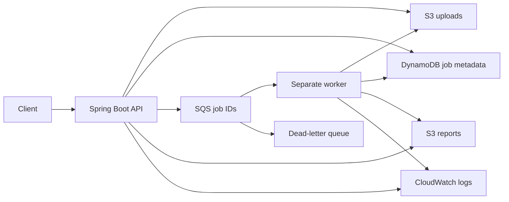

# CloudScale architecture and interview notes

CloudScale processes sales CSV uploads outside the HTTP request. In the AWS demo, the API and worker run as separate ECS/Fargate services using the same Docker image and different Spring profiles.

## Request lifecycle

POST /jobs accepts a multipart file, saves it under a UUID key, creates QUEUED metadata, publishes its ID, and returns HTTP 202. A worker receives the ID and conditionally changes QUEUED to PROCESSING. It reads the CSV, saves a report, and conditionally records COMPLETED. Processing errors attempt to record FAILED. The consumer deletes a message only after confirming a terminal state. GET /jobs/{id} reports status; GET /jobs/{id}/result returns the report or HTTP 409 until completion.

FileStore, JobRepository and JobDispatcher separate business logic from storage and delivery. Default local implementations make development possible without AWS. S3, DynamoDB and SQS adapters enable the cloud path. SalesProcessor knows CSV rules rather than HTTP or AWS.

## Decisions and tradeoffs

- HTTP 202 confirms submission, not completion. Polling keeps a long computation out of the request.
- S3 stores file bytes; DynamoDB stores small job metadata. This separates object storage from status queries.
- SQS absorbs submissions independently of worker availability. Standard queues can deliver duplicates, so the DynamoDB claim uses a conditional update.
- Completed/failed duplicate deliveries are acknowledged without processing again. An in-progress duplicate is retained. This is not an exactly-once guarantee.
- Execution-role permissions let ECS pull images and publish logs. Separate API and worker task roles permit only their storage, metadata and queue operations. Credentials come from task roles, not embedded access keys.
- UUID keys prevent uploaded filenames from choosing storage paths. API filenames are reduced to a basename.
- BigDecimal preserves decimal prices. Each valid row is a transaction line, not necessarily a distinct order. The sample totals 899.99 + 159.98 + 120.00 = 1179.97.
- Commons CSV reads rows incrementally and handles quoting. Aggregation memory grows with distinct group keys; reports are buffered in memory. Uploads are capped at 10 MB. This is not a verified big-data engine.
- DynamoDB listing uses a paginated Scan internally, collects results, then sorts them. This is suitable for the demo; a production listing needs access-pattern indexes and client pagination.
- Terraform owns compute/network/IAM/log resources. Existing S3, DynamoDB and queues were created manually and referenced as data sources. The full data layer is not reproducible through this configuration yet.

## Reliability limits to explain honestly

S3 upload, metadata creation and SQS publication are separate writes. If publication fails, the API returns a generic 503 and the job may remain QUEUED; an outbox or reconciliation process is needed. A worker crash after its claim can strand PROCESSING work. The current implementation has no ownership lease, heartbeat, visibility extension or attempt fencing. Unresolved messages can reach the DLQ; reaching the DLQ does not repair metadata automatically. Invalid CSV processing becomes terminal FAILED and is acknowledged rather than retried indefinitely. Completion-write outages retain the message without falsely marking a saved report as failed.

The demo uses one subnet and IP-restricted HTTP. Authentication, TLS, tenant isolation, autoscaling, alarms, load testing and automatic deployment through GitHub Actions OIDC remain future work. CloudWatch logs and GitHub Actions Java verification are implemented. No throughput, latency or uptime results are claimed.

## Verified evidence

42 tests passed locally and during the Docker build. Live S3 report retrieval, DynamoDB persistence across a process restart, SQS duplicate delivery and DLQ redrive, separate API/worker execution, ECS report processing and CloudWatch completion logging passed. Both ECS services were stopped after the demo. See verification.md for concrete jobs, dates and boundaries.

## Interview walkthrough

1. Trace JobController.create from input validation to the 202 response.
2. Explain JobWorker.process and the conditional status claim.
3. Explain why SqsJobConsumer acknowledges only confirmed terminal jobs.
4. Describe what happens when publication fails or a worker crashes after claiming a job.
5. Explain how task roles differ from execution roles, and which resources Terraform owns.
6. Show the sample report and test evidence; explain which measurements were not made.
